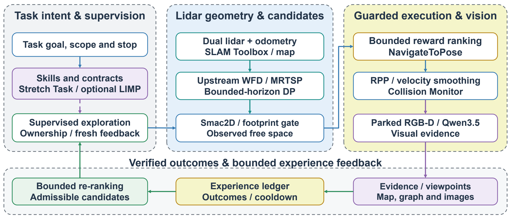
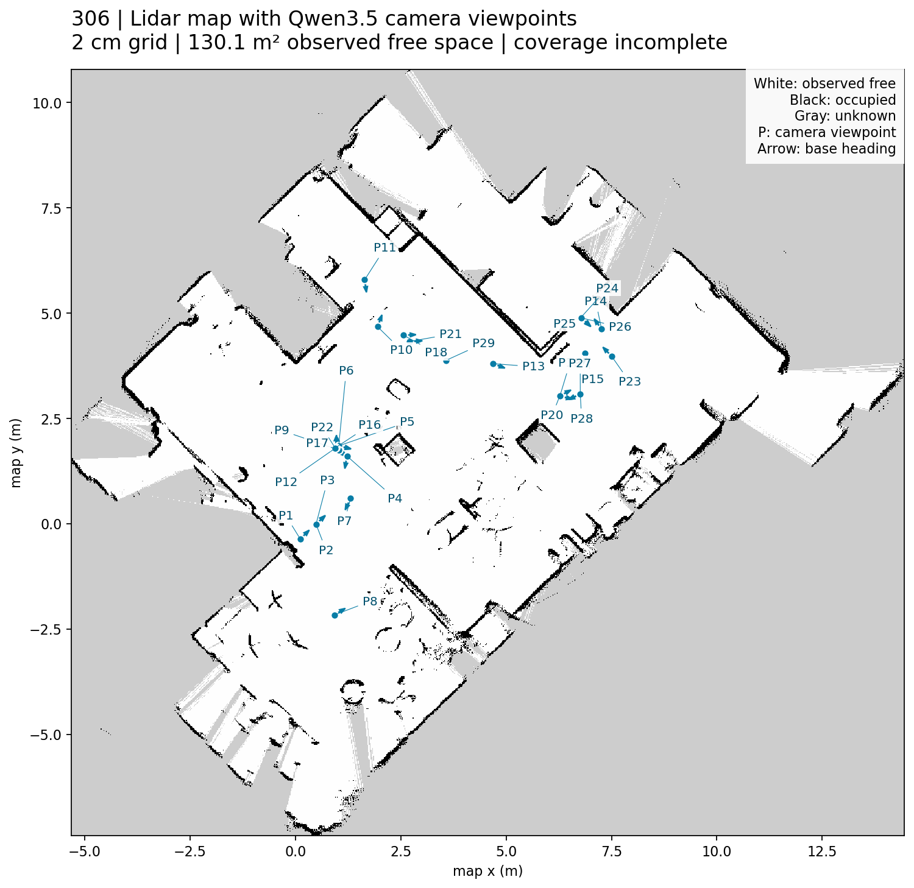

# SEVA

**Semantic Exploration with Verified Actions**

SEVA connects lidar-based exploration, verified navigation outcomes and
vision-language observations on a mobile dual-arm robot. It selects among
geometrically feasible goals, checks the result of each action, and uses bounded
experience feedback to guide subsequent exploration.

本仓库开源 SEVA 的框架与衔接源码。雷达负责几何建图和导航，视觉语言模型负责场景语义；
目标执行结果经过验证后写入经验记录，再参与后续目标选择。



The dashed task-interface link is a separate integration boundary: the evaluated
exploration supervisor directly owns navigation. The general task gateway was
validated for read-only operations; it is not a commissioned hardware motion interface.

## Exploration cycle

1. **Build geometric evidence.** Dual lidar and odometry feed the existing SLAM
   Toolbox map and pose graph.
2. **Generate and validate goals.** Upstream WFD/MRTSP proposes frontiers; history
   supplies revisit candidates. Native Smac2D and footprint checks reject invalid
   paths, unknown-space crossings and unsuitable endpoints.
3. **Rank admissible candidates.** Fixed weights combine visible frontier length,
   upstream ordering, revisit value, observation novelty, travel cost and repeated
   low-gain visits.
4. **Execute and verify.** Native Nav2 navigation remains subject to RPP,
   Collision Monitor and the supervisor's telemetry and ownership checks. Arrival
   requires controller success, fresh stationary feedback and position agreement.
5. **Observe and update.** At a stationary viewpoint, Qwen3.5 produces structured
   scene descriptions. Map changes, qualified graph constraints and observed
   outcomes update the experience ledger.

The outcome reward is an accounting measure. It does **not** train a policy or
update the scoring weights. Semantic annotations locate camera viewpoints;
image boxes are not object coordinates and never modify occupancy or clearance.

## Source layout

| Location | Purpose |
| --- | --- |
| `integrations/exploration306/reward_policy.py` | Scoring, revisit selection, map/graph gain and experience ledger |
| `integrations/exploration306/reward_runner.py` | Native candidate, planning, validation and action integration |
| `integrations/exploration306/native_bridge/` | Read-only C++ bridge to the original frontier library |
| `integrations/exploration306/deployment/` | Session supervisor, health checks, report source and guard tests |
| `integrations/upstream306/` | Task contracts, verified outcomes, RGB-D and semantic adapters |
| `src/zeng_agent/` | Shared agent service and existing robot adapter interfaces |
| `config/` | Credential-free configuration and robot parameter templates |
| `dependencies/` | Upstream revision and entry-point integrity locks |
| `tests/`, `integrations/tests/` | Offline unit and integration tests |

The internal names `zeng_agent`, `upstream306` and `exploration306` are retained
for compatibility with the deployed implementation. Legacy voice, arm and visual
navigation helpers in the shared service are not the exploration controller
evaluated in the SEVA paper.

## Quick start: offline checks

Python 3.10 or newer is required. The core checks do not need a robot, ROS or a
model service. Run from the repository root:

```bash
git clone https://github.com/andyzeng0921/SEVA.git
cd SEVA
python -m venv .venv
source .venv/bin/activate
python -m pip install -e '.[test]'
python -m pytest -q
```

On Windows, activate with `.venv\Scripts\Activate.ps1`. Default pytest discovery
is limited to the core unit tests and pure exploration-policy tests. It does not
launch robot control, record camera data or call a hosted model.

### Optional task gateway

Read [upstream attribution and license information](THIRD_PARTY.md), then obtain
the pinned dependencies. The fetch script downloads source only; it does not
install dependencies, start services or fetch LFS model weights.

```bash
python scripts/fetch_upstream.py --group gateway
cp config.example.yaml config.yaml
export ZENG_PROJECT_ROOT="$PWD"
export ZENG_CONFIG="$PWD/config.yaml"
python -m pytest integrations/tests -q
python -m upstream306 status
```

The example configuration uses dry-run mode with remote models and legacy
autonomous control disabled. Gateway integration tests use fake backends and
temporary state. `--group exploration` fetches the frontier source; `--group all`
fetches both sets. Existing modified dependency checkouts are never overwritten.
Five archive-dependent checks are skipped unless `SEVA_ARCHIVED_CHASSIS_LOG`
points to the separately retained original recording; no recording is bundled.

Release validation on Python 3.12: **93 offline checks passed, 5 archive-dependent
checks skipped** across the core, policy and optional gateway suites. ROS/C++ and
hardware checks require the separate environment described below.

### ROS and robot integration

See [the integration guide](docs/INTEGRATION.md) for ROS 2 Jazzy dependencies,
native bridge compilation, camera binding, VLM configuration and session layout.
Robot-specific drivers, shared-memory camera SDK files, calibrated geometry and
launch services are external requirements. The repository is a source release
of the integration, not a complete robot image.

## Existing experimental observations

The paper analyzes supervised development segments from one environment, with
shared map history and configuration changes. These are descriptive observations,
not a controlled comparison between policies.

| Measurement | Reported value |
| --- | ---: |
| Recorded exploration segments | 15 |
| Sum of recorded segment travel | 79.24 m |
| Final observed free space | 130.15 m² |
| Native graph nodes / edges | 1,403 / 5,361 |
| Structured visual observations retained | 29 |
| Observations associated with graph nodes | 5, across 3 nodes |
| Arrival error of one verified revisit | 0.0721 m |
| Qualified cross-visit constraints added by that revisit | 32 |



The preview shows the archived occupancy map and camera viewpoints, including
historical captures without persistent node bindings. Only same-epoch,
graph-associated views inform spatial novelty in the policy. Coverage remains
incomplete. Qualified cross-visit constraints are not verified global loop-closure
events, and schema acceptance does not establish semantic correctness.

The paper also discusses an earlier manipulation-memory simulation proxy and
author-reported grasp aggregates. They are separate component studies, not new
experiments produced by this exploration release.

## Release scope and paper

This repository contains source, tests, build/configuration templates, documentation
and two illustrations. It excludes experimental recordings, raw maps, scene
photos, model weights, credentials, robot SDK binaries, build outputs and manuscript
PDF/LaTeX archives. The illustrations are previews, not a public experimental
dataset. The archived hardware measurements cannot be regenerated from this
source-only release alone.

The accompanying manuscript is **SEVA: Semantic Exploration with Verified Actions**.
Its code-availability statement links to this repository.

## License

Original SEVA integration code is released under [Apache-2.0](LICENSE).
External components retain their own terms; see [THIRD_PARTY.md](THIRD_PARTY.md).
